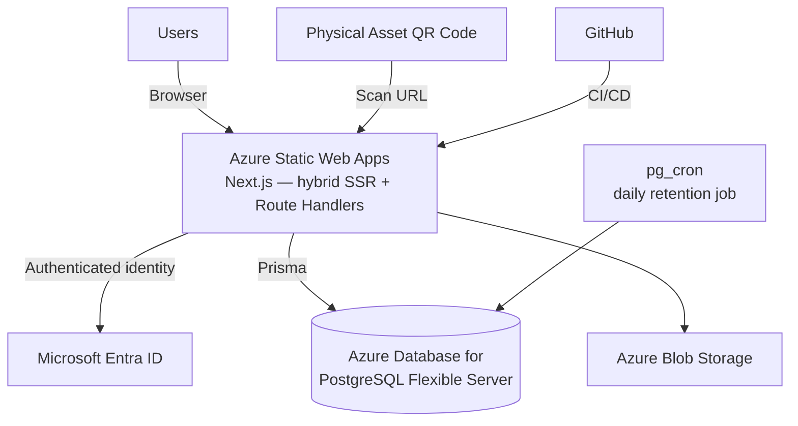

# System Architecture
## Cloud-Based Campus Asset QR & Maintenance Management System

> **Status:** Implementation-ready Azure-native architecture specification
> **Audience:** Claude Code / student development team
> **Architecture rule:** Azure is the target implementation, not a post-build migration layer.

---

# 1. Architecture Goal

The system uses a managed Azure architecture designed for:

- Low implementation complexity
- Low ongoing cost
- Clear cloud-computing concepts
- Strong security
- Easy local development
- GitHub-based CI/CD
- Minimal infrastructure management

This is a green-field build — there is no existing app to preserve or migrate from.

---

# 2. Final Architecture



---

# 3. Architecture Layers

## Layer 1 — Physical / QR Layer

```text
Projector
Laptop
Arduino Kit
Camera
Oscilloscope
    ↓
QR sticker
```

The QR contains a stable public URL:

```text
https://<production-domain>/asset/<public-code>
```

The QR identifies the asset only. It does not encode:

- Current user
- Current room
- Status
- Maintenance request
- Authentication session

---

## Layer 2 — Presentation Layer

Implemented using:

- Next.js
- React
- TypeScript
- Tailwind CSS

Hosted on:

**Azure Static Web Apps**, using its hybrid Next.js support (server-side rendering plus co-located API Route Handlers, both deployed as one app — no separate backend deployment target).

Responsibilities:

- Render UI
- Handle navigation
- Collect input
- Display asset information
- Display dashboards
- Perform client-side UX validation
- Scan/generate QR codes
- Call Route Handlers for all data operations

The frontend must not contain privileged credentials.

---

## Layer 3 — API / Business Logic Layer

Implemented using:

**Next.js Route Handlers** (`app/api/.../route.ts`), running server-side within the same Next.js application — not a separate Azure Functions project.

Responsibilities:

- Authenticate requests (Auth.js + Microsoft Entra ID)
- Resolve application roles
- Validate inputs
- Execute business workflows
- Read/write PostgreSQL via Prisma
- Generate authorized Blob access
- Create audit events
- Return public-safe or private responses
- Enforce concurrency-sensitive operations using real Postgres transactions and constraints

See `11-server-side-logic-edge-functions.md` for Route Handler organization and the one exception to "no separate compute project" (the `pg_cron` retention job, which is DB-native and has no HTTP trigger at all).

---

## Layer 4 — Data and Storage

### Azure Database for PostgreSQL Flexible Server

Stores all structured application data as a normalized relational schema — `users`, `buildings`, `rooms`, `assets`, `assignments`, `maintenance_requests`, `maintenance_history`, `attachments`, `audit_log`. The full schema, including indexes, constraints, and the retention job, is specified in `03-database-schema.md` — that document is the schema source of truth; do not duplicate or re-derive the data model here.

### Azure Blob Storage

Stores binary data:

- Asset photos
- Maintenance photographs
- Repair evidence
- Service reports
- Maintenance documents

All referenced through the single `attachments` table (see `03-database-schema.md` §17).

### Microsoft Entra ID

Provides:

- Authentication
- Identity
- Session/token issuance (via Auth.js)
- Optional organization/tenant integration

---

# 4. Request Flow

Typical authenticated request:

```text
User
 ↓
Azure Static Web Apps
 ↓
Microsoft Entra ID authentication (Auth.js)
 ↓
Route Handler
 ↓
Validate identity + role + input
 ↓
Prisma → PostgreSQL / Blob Storage
 ↓
Audit where required (same transaction as the write it audits)
 ↓
Response
 ↓
Next.js UI
```

Public QR request:

```text
QR scan
 ↓
/asset/<public-code>
 ↓
Azure Static Web Apps
 ↓
Public Route Handler
 ↓
PostgreSQL (by public_code)
 ↓
Limited asset response, or a "no longer in service" tombstone
```

---

# 5. Why Route Handlers Exist

Route Handlers handle workflows that should not be trusted to the browser.

Examples:

```text
createAssignment()
returnAsset()
changeRegisteredLocation()
createMaintenanceRequest()
assignTechnician()
resolveMaintenance()
retireAsset()
changeUserRole()
uploadAttachment()
generateBlobAccess()
createAuditEvent()
```

Simple reads may also go through Route Handlers. The frontend should use a consistent API boundary rather than accessing PostgreSQL directly — there is no path by which it could, since Prisma only ever runs server-side.

---

# 6. Authorization Model

Two layers, both real:

```text
Microsoft Entra ID
      ↓
Authenticated user ID
      ↓
users row lookup
      ↓
Application role (ADMIN / TECHNICIAN / MEMBER)
      ↓
Route Handler authorization (primary layer)
      ↓
Postgres Row-Level Security (defense-in-depth layer)
      ↓
PostgreSQL / Blob Storage
```

The Route Handler is the primary, first authorization boundary — every protected handler performs its own checks independently of the database. Postgres RLS policies sit beneath that as a second, defense-in-depth layer: even a bug in a Route Handler's authorization logic, or a query issued from an unexpected code path, still can't read or write rows the authenticated session shouldn't touch, because the database itself enforces it. See `04-rls-security-policies.md` for the full policy design and the session-variable mechanism that connects an authenticated request to its RLS context.

Frontend checks are UX only.

---

# 7. Data Model Principle

`03-database-schema.md` is the schema source of truth — tables, foreign keys, enums, indexes, and the retention job all live there. This document only describes how the layers above connect to it.

---

# 8. Transaction Boundaries

PostgreSQL provides real ACID transactions. Any operation that touches more than one table — for example, resolving a maintenance request, which writes `maintenance_history`, updates `assets.status`, and writes `audit_log` — is a single database transaction (`prisma.$transaction([...])`). It either commits completely or rolls back completely. There is no partition-alignment trick to design around, no cross-container "transaction" that secretly isn't atomic, and no compensating-write logic needed for the normal case. See `03-database-schema.md` §11–17 and `13-audit-logging.md` for concrete examples.

---

# 9. Search

Search/filter APIs are implemented in Route Handlers, backed by indexed Postgres queries (`03-database-schema.md` §20–21) — including free-text asset name search via a trigram index, which has no equivalent under the old design.

For MVP:

- Equality filters
- Free-text name search (`ILIKE` / trigram)
- Status filtering
- Category filtering
- Building/room filtering
- Assignment filtering
- Maintenance filtering

Do not download the entire asset list into the browser to filter client-side — paginate.

---

# 10. Blob Storage Security

Blob Storage containers are private.

Access flow:

```text
User
 ↓
Route Handler
 ↓
Authenticate + authorize
 ↓
Generate short-lived Blob access
 ↓
Client receives temporary access
```

Do not expose storage account keys to the browser. Do not permanently store temporary access URLs as canonical file identity — `attachments.blob_container` + `attachments.blob_name` is the canonical identity (`03-database-schema.md` §17).

---

# 11. Public Asset API

The public QR endpoint returns a deliberately limited object.

Example:

```json
{
  "publicCode": "AST-2026-00142",
  "name": "Epson Projector P-104",
  "category": "Projector",
  "registeredLocation": "Vyas / VY001",
  "status": "AVAILABLE"
}
```

Do not return the full database row. If the `publicCode` no longer resolves (asset retired and purged by the retention job), return a friendly "this asset is no longer in service" response, not a raw `404`.

---

# 12. Failure Handling

The API returns consistent errors:

```text
400 → Invalid input
401 → Not authenticated
403 → Not authorized
404 → Resource not found
409 → State/concurrency conflict
413 → File too large
415 → Unsupported file type
429 → Rate limited
500 → Unexpected server error
```

Do not expose internal Azure, Postgres, or stack-trace details to users.

---

# 13. Local Development

The developer works locally in VS Code.

```text
VS Code
 ↓
Next.js local dev server (App Router + Route Handlers)
 ↓
Local or dev-tier Azure Database for PostgreSQL (via Prisma)
```

Prisma migrations run against a dev database (a separate Azure Postgres Flexible Server instance, or a local Postgres container) before being applied to production.

---

# 14. Deployment Flow

```text
Developer
 ↓
Git commit
 ↓
GitHub
 ↓
Azure Static Web Apps CI/CD
 ├── Next.js build + deploy (frontend + Route Handlers together)
 └── Prisma migrate deploy against Azure Database for PostgreSQL
 ↓
Production Azure resources
```

No Vercel deployment is part of the target architecture.

---

# 15. Architectural Non-Goals

Do not introduce:

- Vercel
- Supabase
- Railway
- Render
- AWS
- Standalone Express server
- Redis
- Kubernetes
- API Gateway
- Dedicated VM
- A separate Azure Functions project (Route Handlers cover all HTTP-triggered server-side logic; the one exception is the `pg_cron` retention job, which runs inside Postgres itself and has no HTTP trigger — see `11-server-side-logic-edge-functions.md`)

unless a future requirement explicitly changes the architecture.

---

# 16. Definition of Done

The architecture is correctly implemented when:

- Frontend and API are both hosted on Azure Static Web Apps (hybrid Next.js).
- APIs run as Next.js Route Handlers — no separate Functions project exists.
- Identity is Microsoft Entra ID via Auth.js.
- Structured data is stored in Azure Database for PostgreSQL, accessed only through Prisma.
- Files are stored in Blob Storage, referenced through the `attachments` table.
- Server-side authorization is enforced in Route Handlers, with Postgres RLS as defense-in-depth.
- Multi-table writes use real Postgres transactions.
- The `pg_cron` retention job runs on schedule inside Postgres.
- QR URLs remain stable.
- GitHub drives deployment.
- No Cosmos DB, Supabase, or Vercel runtime dependency remains.

---

# Claude Code Execution Boundary

Claude Code implements application code and local project files. Azure resource creation, Azure Portal configuration, secrets, GitHub repository operations, commits/pushes, and deployment are performed by the human developer. Claude Code may provide exact manual instructions and configuration templates, but must not execute or claim completion of those operations.
